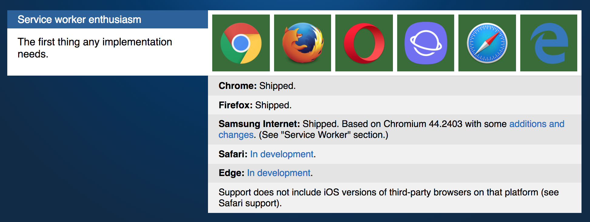
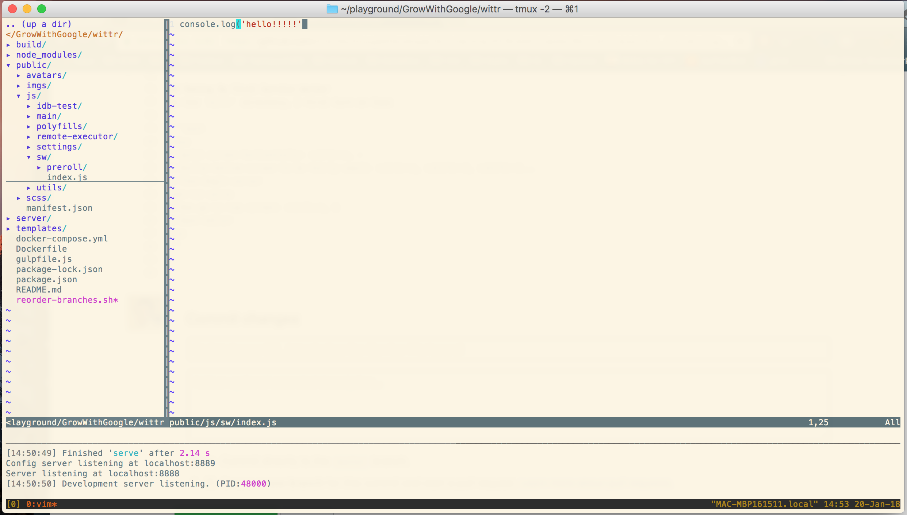

A service worker intercepts requests made in the browser, and can do things with 'em! Basically,
you have a service worker script saved somewhere (e.g., /sw.js), and you "register" it in the browser like so:

```javascript
navigator.serviceWorker.register('/sw.js')
```

This returns a promise, so really you ought to chain it with some then and catch statements:
```javascript
navigator.serviceWorker.register('/sw.js').then(function(reg) {
  console.log('Yay!');
}).catch(function(err) {
  console.log('Boo!');
});
```

## Service Worker Scopes
Optional: You can provide a service worker with a scope. That is, basically, a directory with pages that the 
service worker will control, outside of which the service worker has no dominion.
```javascript
navigator.serviceWorker.register('/sw.js') { 
  scope: '/my-app/' 
});
```

In this case, the service worker will control any page with a URL that goes deeper into /my-app/, but
no shallower URLs like / or other branches, like /my-other-app/.

The benefit is that you can then create multiple service workers with differing scopes.  The example
of GitHub is given, where multiple projects share the same origin:


The default scope of a service worker is the directory in which the service worker script sits, making
it often unneccesary to specify the scope (just put the different service workers in their different
parent directories).

## Events
What does a service worker do?  It listens to events!  Here are some examples of statements
you might find in some service worker code:
```javascript
self.addEventListener('install', function(event) {
  //...
});

self.addEventListener('activate', function(event) {
  //...
});

self.addEventListener('fetch', function(event) {
  //...
})
```

## Service Worker Support
> "Every browser has expressed some interest in implementing [service worker], but as of 2015, 
> service worker is only supported in Chrome and Opera -- with Firefox support soon to land."

So, uh, to my mind -- Chrome, Firefox -- good enough! :-p

This actually got me interested: how often are other browsers even being used? A quick Google search
brought me to a Browser Statistics page on W3schools.  Here are the 2017 stats:


Without Safari or IE, we are still talking about 90% of the market share here...so, like I said, 
good enough! 

Better, I checked out the website from the video ([Is Service Worker Ready?](https://jakearchibald.github.io/isserviceworkerready/)),
and IE and Safari both jumped on board.



-----------------------------------------

## Making My First Service Worker
In the `wittr` directory, I first turn on tmux 

```bash
tmux
# Split screen horizontally: <ctrl>+a, -
# Resize bottom screen to be fairly small: <ctrl>+a, <shift>+J, <shift>+J...
# Then begin server
npm run serve  
# Now go to top screen: <ctrl>+a, k
# Open editor
vim
```




Now, in the Nerd Tree file browser go to public > js > sw > index.js:
```js
console.log('js')
```

To see this in the browser:
```
localhost:8888/sw.js
```

Something we might actuall put in index.js is a fetch event listener:
```js
self.addEventListener('fetch', function(event) {
  console.log(event.request)
});
```
-----------------------------------------------------------

## Quiz
Above, we added a fetch listener to a service worker script, but now we need to register
it from the page.

To get the wittr code in the same state as Jake's, we must reset git and change branches.

Reset the changes I made:
```git
git reset --hard
```

Change git branch I'm working on:
```git
git checkout task-register-sw
```

Now...if you're already hooked into the server, how does the server know which git 
branch to take code from...?  (Not fully sure...)

To register the service worker, we go to public > js > main > IndexController.js.

### Private Methods (by Convention Only)
Just like in Python, Javascript does not have truly private methods.  Instead, similar to Python,
the convention is to begin a method name with an underscore if one wants to let other programmers
know that this method should be treated as if it were private.


--------------------------------------------------


# ServiceWorker Life Cycle
* a page must be refreshed twice for a ServiceWorker to begin its service
* if the ServiceWorker is changed, the modified ServiceWorker will wait for all pages using the current version to stop

### Chrome Canary
* download it frequently: basically a nightly build of "bleeding edge" Chrome
* has all new Chrome features, many of which are not in official Chrome release
* https://www.google.com/chrome/browser/canary.html

### ServiceWorker Services in DevTools


1. In the Console tab, by default your code is against the document, but you can use the dropdown menu and choose your environment context to be the ServiceWorker
2. In the Applications tab, there is a ServiceWorker section
  -- you can unregister the ServiceWorker here so that you can register a new one from scratch (stop the current one and activate the new one)
  -- you can make this your default setting by clicking on "Update on reload"

Outside of DevTools, you can also unregister the old / register the new by holding on \<shift\> when you refresh 
the page (shift+cmd+r).  The DevTools option makes it more developer-friendly.  Btw, the regular, awkward way to do this
(e.g., as an app user) is to navigate away from any/all pages using the current ServiceWorker (super dev-unfriendly).

--------------------------------------------------------

```js
self.addEventListener('fetch', function(event) {
	// TODO: respond to all requests with an html response
	// containing an element with class="a-winner-is-me".
	// Ensure the Content-Type of the response is "text/html"
  event.respondWith(
    new Response('<strong class="a-winner-is-me">Yo!</strong>',{
      headers: {'content-type': 'text/html'}
    })
  );
});
```

## Selectively Intercept Requests
https://developer.mozilla.org/en-US/docs/Web/API/Request

```js
self.addEventListener('fetch', function(event) {
  // TODO: only respond to requests with a
  // url ending in ".jpg"
  if (event.request.url.substr(-4) === '.jpg') {
      event.respondWith(
        fetch('/imgs/dr-evil.gif')
  );
  }
});
```

## Error Handling
```js
self.addEventListener('fetch', function(event) {
  event.respondWith(
    fetch(event.request).then(function(response) {
      if (response.status === 404) {
        // TODO: instead, respond with the gif at
        // /imgs/dr-evil.gif
        // using a network request
        return fetch('/imgs/dr-evil.gif');
      }
      return response;
    }).catch(function() {
      return new Response("Uh oh, that totally failed!");
    })
  );
});
```

# The Cache API: Caching & Serving Assets
```js
caches.open('my-stuff').then(function(cache) {
  //...
});
```
If the cache already exists, it is opened; else, it is created and opened.

```js
// pass one of these into caches.open('my-stuff').then(function(cache){...} 
cache.put(request, response);
cache.addAll([
    '/foo',
    '/bar',
]);
```

In `cache.addAll()`, one failed request fails the whole thing...

```js
cache.match(request);
caches.match(request); // searches through all caches, starting w/ oldest
```

### Example
```js
self.addEventListener('install', function(event) {
  var urlsToCache = [
    '/',
    'js/main.js',
    'css/main.css',
    'imgs/icon.png',
    'https://fonts.gstatic.com/s/roboto/v15/2UX7WLTfW3W8TclTUvlFyQ.woff',
    'https://fonts.gstatic.com/s/roboto/v15/d-6IYplOFocCacKzxwXSOD8E0i7KZn-EPnyo3HZu7kw.woff'
  ];
  event.waitUntil(
    // TODO: open a cache named 'wittr-static-v1'
    // Add cache the urls from urlsToCache
    caches.open('wittr-static-v1').then(function(cache){
      cache.addAll(urlsToCache);
    })
    //
  );
});

self.addEventListener('fetch', function(event) {
  // Leave this blank for now.
  // We'll get to this in the next task.
  event.respondWith(
    caches.match(event.request).then(function(response){
      if (response) return response;
      return fetch(event.request);
    })
  );
});
```


* https://developer.mozilla.org/en-US/docs/Web/API/ServiceWorker
* https://developer.mozilla.org/en-US/docs/Web/API/Cache
* https://developer.mozilla.org/en-US/docs/Web/API/CacheStorage

## Some Service Worker Goals
* unobtrusive app updates
* get user on latest version
* continually update cache
* cache photos, avatars...


## Updates to CSS
Task: Update CSS w/o disrupting the currently running version of site/app
* go into public > scss and update SASS vars
* change cache name in the install eventListener (e.g., v1 -> v2)

```js
self.addEventListener('install', function(event) {
  event.waitUntil(
    // TODO: change the site's theme, eg swap the vars in public/scss/_theme.scss
    // Ensure at least $primary-color changes
    // TODO: change cache name to 'wittr-static-v2'
    caches.open('wittr-static-v2').then(function(cache) {
      return cache.addAll([
        '/',
        'js/main.js',
        'css/main.css',
        'imgs/icon.png',
        'https://fonts.gstatic.com/s/roboto/v15/2UX7WLTfW3W8TclTUvlFyQ.woff',
        'https://fonts.gstatic.com/s/roboto/v15/d-6IYplOFocCacKzxwXSOD8E0i7KZn-EPnyo3HZu7kw.woff'
      ]);
    })
  );
});

self.addEventListener('activate', function(event) {
  event.waitUntil(
    // TODO: remove the old cache
    caches.delete('wittr-static-v1')
  );
});

self.addEventListener('fetch', function(event) {
  event.respondWith(
    caches.match(event.request).then(function(response) {
      return response || fetch(event.request);
    })
  );
});
```

## Letting the User Know an Update is Ready
When you register a service worker, a registration promise is returned, so we can
use `.then`, etc.

```js
navigator.serviceWorker.register('/sw.js').then(function(reg){
  // the promise returns a registration object w/ the
  // following methods and properties
  reg.unregister();
  reg.update();
  reg.installing;  // keeps track of SW state
  reg.waiting;
  reg.active;
  reg.addEventListener('updatefound', function() {
    // reg.installing has changed 
  });
})
```

The `reg.installing` object has a state property:
```
let sw = reg.installing;
console.log(sw.state); // ...logs "installing"
```

`reg.state` can be:
* installing
* installed
* activating (the activate event has fired, but is not yet complete)
* activated  (ready to receive fetch events)
* redundant  (the SW has been thrown away; happens when SW is superceded by new SW or fails to install)

The service worker fires an event any time the state changes...
```js
let sw = reg.installing;
sw.addEventListener('statechange', function() {
  // sw.state has changed
})
```


The registration object points to the Service Worker and gives us the ability
to monitor and control the Service Worker's lifecycle.

--------------------------------------------------------------------

This part of the course definitely assumes that I know way more than I do... Here are some
more helpful resources:

* [Google's PWA Book](https://google-developer-training.gitbooks.io/progressive-web-apps-ilt-concepts/content/)
* [Offline Cookbook](https://developers.google.com/web/fundamentals/instant-and-offline/offline-cookbook/)
* [The App Shell Model](https://developers.google.com/web/fundamentals/architecture/app-shell)


