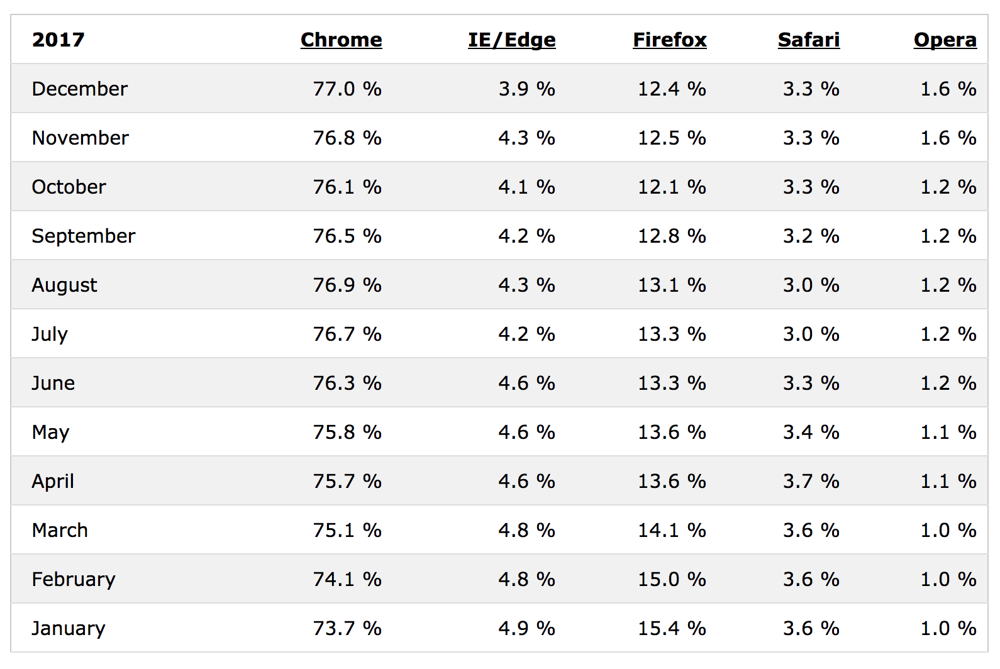

A service worker intercepts requests made in the browser, and can do things with 'em! Basically,
you have a service worker script saved somewhere (e.g., /sw.js), and you "register" it in the browser like so:

```javascript
navigator.serviceWorker.register('/sw.js')
```

This returns a promise, so really you ought to chain it with some then and catch statements:
```javascript
navigator.serviceWorker.register('/sw.js').then(function(reg) {
  console.log('Yay!');
}).catch(function(err) {
  console.log('Boo!');
});
```

## Service Worker Scopes
Optional: You can provide a service worker with a scope. That is, basically, a directory with pages that the 
service worker will control, outside of which the service worker has no dominion.
```javascript
navigator.serviceWorker.register('/sw.js') { 
  scope: '/my-app/' 
});
```

In this case, the service worker will control any page with a URL that goes deeper into /my-app/, but
no shallower URLs like / or other branches, like /my-other-app/.

The benefit is that you can then create multiple service workers with differing scopes.  The example
of GitHub is given, where multiple projects share the same origin:


The default scope of a service worker is the directory in which the service worker script sits, making
it often unneccesary to specify the scope (just put the different service workers in their different
parent directories).

## Events
What does a service worker do?  It listens to events!  Here are some examples of statements
you might find in some service worker code:
```javascript
self.addEventListener('install', function(event) {
  //...
});

self.addEventListener('activate', function(event) {
  //...
});

self.addEventListener('fetch', function(event) {
  //...
})
```

## Service Worker Support
> "Every browser has expressed some interest in implementing [service worker], but as of 2015, 
> service worker is only supported in Chrome and Opera -- with Firefox support soon to land."

So, uh, to my mind -- Chrome, Firefox -- good enough! :-p

This actually got me interested: how often are other browsers even being used? A quick Google search
brought me to a Browser Statistics page on W3schools.  Here are the 2017 stats:



