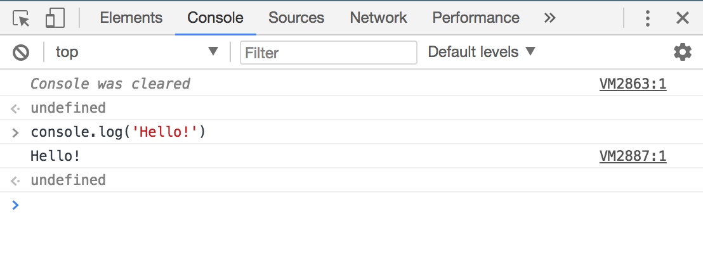
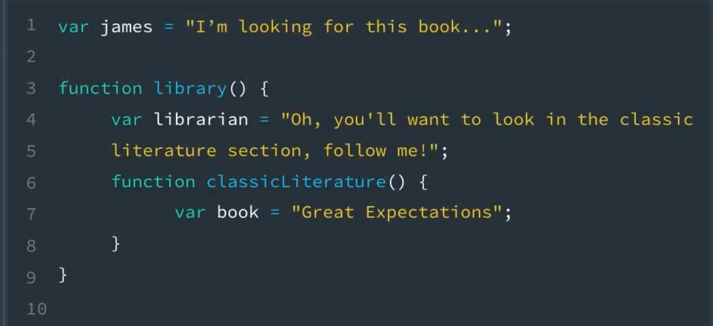
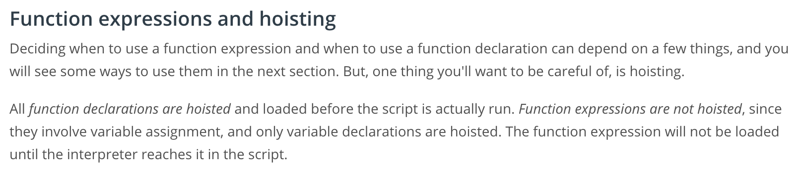

Interestingly, functions can be written to ways.

One way is like how it's done in R, or using lambda in python.  The other way is more similar 
to how its usually done in Python.  

## Function Definition: Method 1

JavaScript:
```js
myFcn = function(x) {
  return(x*x)
}
```

This is similar to how you might define the function in R:
```r
myFcn = function(x) {
  return(x*x)
}
```

You might also say it's similar to how you can define a Python function using the lambda
method:
```python
myFcn = lambda x: x*x
```

Later on in the lesson, I learned that this technique is called 
a "function expression."  It assigns an anonymous function to a variable.

## Function Definition: Method 2
This is the way they showed how to define a function in the course.  This technique
is called "function declaration."  All function declarations in a script a hoisted
to the top (see section on hoisting below); this is not true of function expressions.

JavaScript:
```js
function myFcn(x) {
  return(x*x);
}
```

This seems to result in the same thing, so one might wonder why there would be two
equivalent syntaxes... But then again, Python also has a second, similar method as well!

```python
def myFcn(x):
  return x*x
```

------------------

## No Arguments: Hello!
```js
function hello() { console.log('Hello!'); }
```

## One Argument: Reverse String
```js
rev = function(str) {
    var revStr="";
    for (var i=str.length-1; i >= 0; i--) {
        revStr += str[i];
    }
    console.log(revStr)
}
```

## Add two numbers
```js
function add2(x,y) {
  var z = x+y
  return(z);
}
```

## Parameters vs Arguments
* A **parameter** is always going to be a variable name and appears in the function declaration. 
* An **argument** is always going to be a value (a number, a string, a boolean, etc.) and will always appear in the code when the function is called or invoked

* **Parameters** are variables that are used to store the data that's passed into a function for the function to use 
* **Arguments** are the actual data that's passed into a function when it is invoked

Example:
```js
function add2(x,y) { 
  var z = x + y;
  return z
}
add2(5,9)
  14
```

Here, x and y are parameters of the function `add2`, while 5 and 9 are arguments.


### Math Analogy
In terms of math, take a polynomial function: 
* f(x;a,b,c) = ax^2 + bx + c
* g(x) = f(x;1,2,3) = x^2 + 2x + 3

Here, a, b, and c are parameters of a quadratic polynomial. Without specifying them, the
function represents an infinite class of polynomials.  By specifying parameter arguments 1,
2, and 3, we select a single polynomial from the class.  

------------------------------------------------------

## Undefined Function Return


In JavaScript, a function always returns something. If a function does not explicitly return 
something, as far as JS is concerned, it returns "undefined." That's why in the Chrome JS Console,
any time you type something like console.log('Hello!'), it prints "Hello!" to the screen, but also
shows that "undefined" was returned.

## Two Ways to Return Data
* cosole.log
* return

They cover this in some detail, but the gist is that console.log is basically a print statement,
while return is...well...a return statement.  Just like using print() in Python or R, it is best
used for things like debugging and keeping the user informed about what's going on as code runs.

Interested factoid: the print() function in the JavaScript console will bring up the printer 
dialog...so it makes sense why we use console.log() in JS instead of print().

## Using Return Values
There's not much to say besides it seems like "var" is used any time a new variable is
being used/defined:
```js
function add2(x,y) { return x+y; }
var z = add2(3,5)
```

However, I do notice they just use "return x+y" here, where earlier they first defined
a new var, z, in the function body...

## Scope
Any variable defined in the main environment has global scope, and can be accessed from
any functions inside that environment, functions inside those functions, and so on.


A variable defined in a function environment is not seen in the main environment, but is
seen in any function within the current function environemnt.


All of this can be summarized in various ways: 
* a variable's scope propagates to child environments, but not parent environments
* a variable's scope extends from its environment to all descendants, and excludes any ancestors



## Shadowing / Scope Overriding
The reason it is important to use "var" reflexively is to ensure you are not screwing over
variables in your parent environments.

In the following code, we have a variable book in the parent environment, and again in
the function environment.  However, we do not use the "var" keyword in the function 
environment, so JS thinks, "Create a new variable unless this one already exists in the current
scope." Fact is, "book" already exists in the current scope because it was defined in the main
environments, and its variables have scope in all environmental descendants, unless overriden.

```js
var book = 'Do Androids Dream of Electric Sheep?'
console.log(book)
  Do Androids Dream of Electric Sheep?
bookReview = function(adjective) {
  book = 'Galactic Pot Healer'
  console.log(book + ' was a ' + adjective + ' book!')
}
bookReview('great')
  Galactic Pot Healer was a great book!
console.log(book)
  Galactic Pot Healer
```


To ensure a variable in a parent environment will not be affected, it is
good practice to always use the "var" keyword when creating a variable -- that is,
unless you explicitly want to affect something in the parent environment.

```js
var book = 'Do Androids Dream of Electric Sheep?'
console.log(book)
  Do Androids Dream of Electric Sheep?
bookReview = function(adjective) {
  var book = 'Galactic Pot Healer'
  console.log(book + ' was a ' + adjective + ' book!')
}
bookReview('great')
  Galactic Pot Healer was a great book!
console.log(book)
  Do Androids Dream of Electric Sheep?
```

It is advised to limit the use of global variables as much as possible. Large programs are
much easier to maintain and understand when variables have limited scope.


## Hoisting, or: Why Bad Code is Bad
This is almost something that needn't be said, but it needs to be said!  JavaScript
hoists all functions to the top of its program flow, so things like this are 
technically legal:
```js
add(3,5);
function add2(x,y) { return x+y; }
```

That's because JavaScript reorganizes things behind the scenes and interprets your
code like this:
```js
function add2(x,y) { return x+y; }
add(3,5);
```

There is also a type of variable hoisting too... 
```js
function sayHi(name) {
  console.log(greeting + " " + name);
  var greeting = 'Hi';
}
sayHi('Kevin')
  undefined Kevin
```

JavaScript puts all variable declarations at the top of the environment, so your
code might look like that above, which is obviously wrong and should throw an error...but
JavaScript will see it as:
```js
function sayHi(name) {
  var greeting;
  console.log(greeting + " " + name);
  greeting = 'Hi';
}
sayHi('Kevin')
  undefined Kevin
```


Point is, write good code:
* write all functions at top
* write all variable definitions at top of their environment

-----------------------------------

## Build a Triangle
```js
/*
 * Programming Quiz: Build A Triangle (5-3)
 */

// creates a line of * for a given length
function makeLine(length) {
    var line = "";
    for (var j = 1; j <= length; j++) {
        line += "* ";
    }
    return line + "\n";
}

// your code goes here.  Make sure you call makeLine() in your own code.
function buildTriangle(num) {
    var output = "";
    for (var i=1; i<=num; i++) {
        output += makeLine(i);
    }
    return output
}

// test your code by uncommenting the following line
console.log(buildTriangle(10));
```

----------------------------------

## Function Expressions
Ok, so I've been using these throughout the notes... Though functions made from function expressions behave like
functions made from function declarations, there are some important difference behind the scenes. Namely,
function expressions do not get hoisted.




When using function expressions, you want to use the var keyword to avoid scope shadowing.


## Callbacks: Functions as Parameters
In the calculus of variations, we study functionals. A functional is a function of a function. For example,
F{f}(x) = integral(f; 0,x) takes in a function, f, and spits out a new function, F{f}(x).  So, if we feed
f(t) = t, we get F{t}(x) = integral(t; 0,x) = x^2.  

Anyway, F{f} is called a functional.  In JS speak, the function f is the parameter of that functional, and the
specific function, f(t) = t, we used in the example is an argument.  If a function parameter is a function,
we call that parameter a callback.  In mathspeak, a callback is the variable input function to a functional.


## Inline Functional Expressions
There is an option to given an "internal name" to a function that is assigned to a variable. Doing so
does not seem to affect the function at all; the two functions below seem to be equivalent.
```js
#1: Anonymous Function Expression
var myFcn1 = function(x) { 
  // x,y,z
}
#2: Named Function Expression
var myFcn2 = function fcnName(x) {
  // x,y,z
}
```

Using a named function expression can seem pretty silly at first,
especially because the "internal" function name (in this case, "fcnName") is not usable afterwards;
only the variable name of the function.  However, when you start getting more advanced, you might
want to pass function expressions to a functional as an argument (inline).  In this case,
using a named function expression can help with code readability:
```js
#1: Anonymous inline function expression
someFunctional(function(x) {
  // do stuff
  }, arg2, arg3
);
#2: Named inline function expression
someFunctional(function getMovieReview(x) {
  // do stuff
  }, arg2, arg3
);
```

If the function body above is fairly complex above, then it is helpful to provide the
function expression with a descriptive name that indicates clearly what the function does.

-------------------------------------------------
## Quiz
```js
/*
 * Programming Quiz: Inline Functions (5-6)
 */

// don't change this code
function emotions(myString, myFunc) {
    console.log("I am " + myString + ", " + myFunc(2));
}

// your code goes here
// call the emotions function here and pass in an
// inline function expression
emotions("happy", function(num) {
    var output = '';
    for (i=1; i<=num; i++) {
        output += 'ha'
    }
    return output+'!';
})
```

