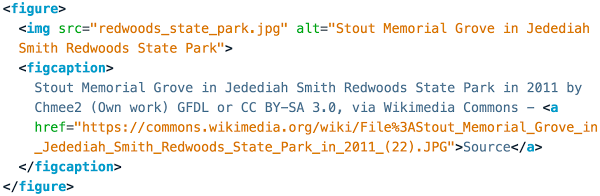

## Buttons
Buttons are simple enough:
```html
<button>This is a button</button>
```

I learned something new when looking them up on the MDN page about 
[buttons](https://developer.mozilla.org/en-US/docs/Web/HTML/Element/button), namely that
they accept "phrasing content."
 
Well, shiz, what is phrasing content?
 
### Phrasing Content
Elements belonging to the [phrasing content](https://developer.mozilla.org/en-US/docs/Web/Guide/HTML/Content_categories#Phrasing_content)
category are: \<abbr>, \<audio>, \<b>, \<bdo>, \<br>, \<button>, \<canvas>, \<cite>, \<code>, \<command>, \<data>,
\<datalist>, \<dfn>, \<em>, \<embed>, \<i>, \<iframe>, \, \<input>, \<kbd>, \<keygen>, \<label>, \<mark>, \<math>,
\<meter>, \<noscript>, \<object>, \<output>, \<progress>, \<q>, \<ruby>, \<samp>, \<script>, \<select>, \<small>, 
\<span>, \<strong>, \<sub>, \<sup>, \<svg>, \<textarea>, \<time>, \<var>, \<video>, \<wbr>, and plain text.
 
Other elements belong to this category, but only if a specific condition is filled:
* \<a> if it contains only phrasing content
* \<area> if it is a descendant of a \<map> element
* \<del> if it contains only phrasing content
* \<ins> if it contains only phrasing content
* \<link> if the <strong>itemprop</strong> attribute is present
* \<map> if it contains only phrasing content
* \<meta> if the <strong>itemprop</strong> attribute is present
 
I took the time to painstakingly write this out b/c holy cow! I thought I knew HTML, at least a little
bit.  But all of this?  Half of the tags I don't recognize.  And this info on phrasing content is
just the beginning: there are other [categories of content](https://developer.mozilla.org/en-US/docs/Web/Guide/HTML/Content_categories)
as well: metadata content, flow content, sectioning content, heading content, embedded content, interactive content,
palpable content, and form-associated content.  The categories share some tags, but also have their own -- again, many of
which I have not used in the past.
 
So going back to the basics was a good idea!
 
### Now: More About Buttons!
So many attributes:
* autofocus
* autocomplete
* disabled
* form
* formaction
* formenctype
* formmethod
* formnovalidate
* formtarget
* name
* type
* value

-------------------------------------------------

## Unordered Lists
```html
<ul>
  <li> HTML </li>
  <li> CSS </li>
  <li> JavaScript </li>
</ul>
```

## Tree to HTML
```html
<!DOCTYPE html>
<html lang="en">
<head>
  <meta charset="UTF-8">
  <title>Tree to HTML</title>
  <!-- the next line loads the tests for the Udacity Feedback extension -->
  <meta name="udacity-grader" content="http://udacity.github.io/fend/fend-refresh/lesson2/problem-set/tree-to-html/tests.json">
</head>
<body>
  <!-- Did you notice that the body tag - the top of the sample tree - is already here? You don't need to add another one. -->
  <!-- Your code goes here! -->
  <h1>Yo, meng!</h1>
  <div>
    <p>Ever hear about the duck that moo'd like a cow?</p>
    <p>He made for an interesting hamburger!</p>
  </div>
</body>
</html>
```

## Anchor Tags
Think you know everything about anchor tags?  I didn't.  Check out the [MDN documentation](https://developer.mozilla.org/en-US/docs/Web/HTML/Element/a).

Attributes:
* download
* href
* hreflang
* ping
* referrerpolicy
* rel
* target
* type


## Img Tags
Think you know everything about img tags?  I didn't (again).  Check out the [MDN documentation](hhttps://developer.mozilla.org/en-US/docs/Web/HTML/Element/img).

Non-deprecated Attributes:
* alt
* crossorigin
* decoding
* height
* hspace
* ismap
* longdesc
* name
* referrerpolicy
* sizes
* src
* srcset
* width
* usemap
* vspace

## The Figure Tag
<figure>
   tag">
  <figcaption>
    This example of the figure tag is actually using a figure tag!
  </figcaption>
</figure>


