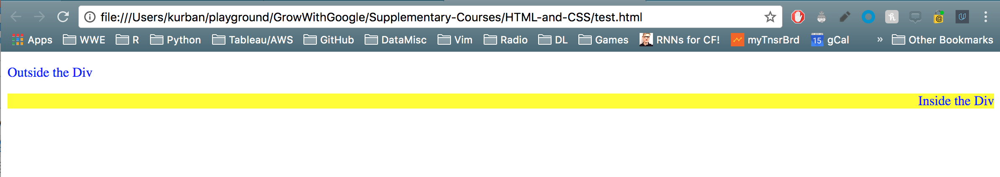

Fun little thing: go to any website, open up developer tools (cmd+alt+j), 
and delete all the style tags! This will transform even the beautiful of website into ugly, garbled messes! 

Note: \<link> tags also have CSS.  Erase those too!

```html
<link rel="stylesheet" href="//s.ytimg.com/yts/cssbin/www-core-webp-vflCayM79.css" 
  name="www-core" class="css-httpssytimgcomytscssbinwwwcorewebpvflCayM79css">
```
--------------------------------------------


## CSS Rulesets
A CSS Ruleset is made up of 2 parts: a selector (which HTML element do you want to style?)
and a declaration block (how do you want to style it?). The bits of code in the declaration
block (anything within the curly braces) are called declarations.

Example:
```css
div {
  text-align: right;
}
p {
  color: blue;
}
```

## Head CSS
One way to add CSS to your HTML is through a \<style> tag within the HTML \<head> tag, e.g.:
```html
<!DOCTYPE html>
<html>
<head>
  <style>
    div {
      text-align: right;
      background-color: yellow;
    }
    p {
      color: blue;
    }
  </style>
</head>
<body>
  <p>Outside the Div</p>
  <div>
    <p>Inside the Div</p>
  </div>
</body>
</html>
```

<figure>
  
  <figcaption> Example in the Browser </figcaption>
</figure>

## CSS Comments
```css
/* This is a CSS comment */
h1 {
  color: red;
}
```

What I learned here is that this is how you do a CSS comment inside of
an HTML style tag too!

```html
<!DOCTYPE html>
<html>
<head>
  <style>
    /* This is a CSS comment */
    h1 {
     color: red;
    }
  </style>
</head>
<body>
  <h1>Hola!</h1>
</body>
</html>
```

## CSS Attributes and Selectors
Using just a selector, like p, any style is applied to all matching tags in the corresponding
HTML document.  But what if we have different sections of the webpage that should have different stylings?

Solution: We can use the tag attributes "id" and "class".

IDs are special and should be used sparingly: 
* an HTML element can have only one ID
* a specific ID can only be used once per page
```css
#site-description {
  color: red;
}
```

More generally, you will style collections of elements -- and for this, you need the class attribute.
```css
.book-summary {
  color: blue;
}
```

EXAMPLE

```html
<!DOCTYPE html>
<html>
<head>
  <meta charset="utf-8">
  <title>My Book Website</title>
  <style>
    h1 {
      color: green;
    }
    h2 {
    }
    #site-description {
      color: red;
    }
    .book-title {
      text-align: center;
    }
    .book-summary {
      color: blue
    }
  </style>
</head>
<body>
  <h1>My Book Website</h1>
  <p id="site-description"> Do you like books? Doesn't matter: I do! And here is my website about it.</p>
  <h2 class="book-title"> Do Androids Dream of Electric Sheep? </h2>
  <p class="book-summary">Quite hard to distinguish between humans and androids! </p>
</body>
</html>
```

##  CSS References
* https://developer.mozilla.org/en-US/docs/Web/CSS/Reference
* https://css-tricks.com/almanac/

## Stuff
* What property is used to italicize text?
  - font-style
* Underline?
  - text-decoration
* Uppercase?
  - text-transform
* Bold?
  - font-weight

