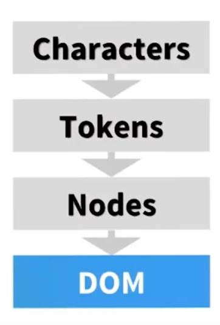

## The Document Object Model (DOM)
The DOM 

The HTML spec provides a set of rules for how an HTML document should be 
interpreted. When the interpreter comes across a tag, a token is emitted, e.g.,
when the <html> tag is reached, a HTML startTag token is emitted.  There is
another process that receives the emitted tokens and converts them
into nodes of a graph, e.g., when the startTag:HTML token is received, the
graph's HTML node is created.  On this graph, the HTML node is the root
node.

Tags netsted within a tag becomes child nodes of a parent node, e.g., the
<head> and <body> tags are children of the <html> node, which is their
parent node.  The <head> node often has its own children: the <title> node,
the <meta> node, a <script> node, etc. Similarly, the <body> node has 
its own children: 
 nodes, 
 nodes, and so on, each of which often
have their own children as well.

The DOM is the fully-parsed representation of the HTML mark-up.  It reflects all relationships between
nodes, and the properties/attributes of each node, e.g., and  node has a src attribute, etc.

So, to recap:

