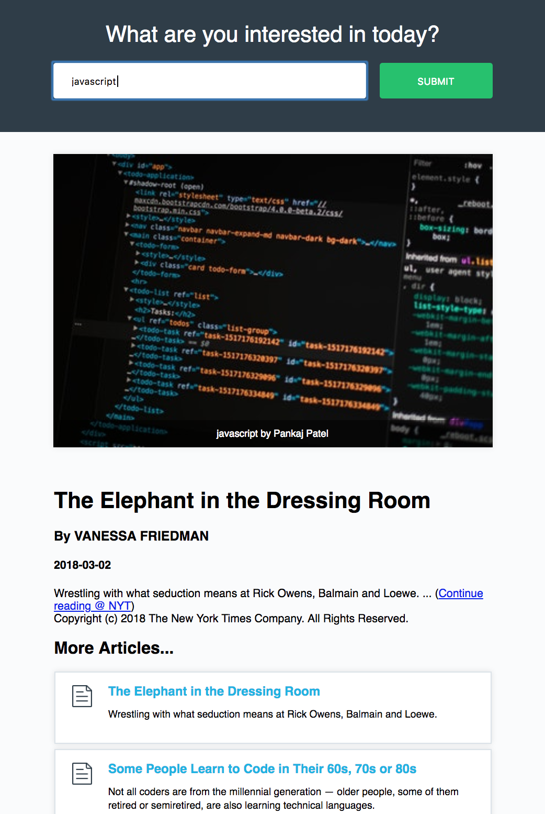

Ok, so if using XHR objects was like having to do every little part of the job of baking a cake yourself (figure out the ingredients,
go buy the ingredients, measure the ingredients, etc); and if using jQuery was like having a baker do it all for you; then
this next method (using the Fetch API) is a little like being the professional baker yourself.  That is, the Fetch API lets
you have the custom feel of the XHR object w/ the power of the jQuery library, but is native to the browser (no need
to import an library).

The Fetch API is promises-based... I know a little about this from some of the GrowWithGoogle videos, but
honestly not a lot. Here's my take: if you were to code synchronously, then you would have control of
when each operation occurred.  However, this can block the call stack for an unnecessary amount of time
for certain operations -- wouldn't it be better if we could get some other work done while a lengthy process
was running in the background?  That is where pure async coding comes in.  However, in this case, there is
no control: if you put a few processes in the background, there is not way to know which will finish in what
order every time.  Wouldn't it be nice if you can have a little more control?  That's where promises come in:
you can have "ordered" async operations.

Anyway, I'll finish up taking some notes on Fetch, then head over the Udacity course on 
[JavaScript Promises](https://www.udacity.com/course/javascript-promises--ud898).

---------------------------------------------

* fetch is replacing utility of XHR object
* fetch still respect the cross origin protocol

Ex
```js
fetch('https://api.unsplash.com/search/photos?page=1&query=flowers');
```


[Fetch Docs on MDN]

> "The fetch() method of the WindowOrWorkerGlobalScope mixin starts the process of fetching a resource from the network. This returns a promise that resolves to the Response object representing the response to your request.
>
> WorkerOrGlobalScope is implemented by both Window and WorkerGlobalScope, which means that the fetch() method is available in pretty much any context in which you might want to fetch resources.

Example
```js
var myImage = document.querySelector('img');
var myRequest = new Request('flowers.jpg');

fetch(myRequest).then(function(response) {
  return response.blob();
}).then(function(response) {
  var objectURL = URL.createObjectURL(response);
  myImage.src = objectURL;
});
```

Example w/ Headers
```js
var myImage = document.querySelector('img');
var myHeaders = new Headers();
myHeaders.append('Content-Type', 'image/jpeg');
var myInit = { method: 'GET',
               headers: myHeaders,
               mode: 'cors',
               cache: 'default' };
var myRequest = new Request('flowers.jpg');

fetch(myRequest,myInit).then(function(response) {
  ... 
});
```

Simple Example (from [Using Fetch](https://developer.mozilla.org/en-US/docs/Web/API/Fetch_API/Using_Fetch))
> The simplest use of fetch() takes one argument — the path to the resource you want to fetch — and returns a promise containing the response (a Response object).
```
fetch('http://example.com/movies.json')
  .then(function(response) {
    return response.json();
  })
  .then(function(myJson) {
    console.log(myJson);
  });
  
  https://developer.mozilla.org/en-US/docs/Web/API/Fetch_API
    
```

The second argument of fetch can be a Headers object, or a regular object.  The above
examples mostly use the Header object.  Here is how to change the request type using
a regular object:
```js
fetch(`https://api.unsplash.com/search/photos?page=1&query=${searchedForText}`, {
    method: 'POST'
});
```

--------------------------

> The .json() method on a Response object returns a Promise, so we need to chain on another .then() to actually get and start using the returned data. This time, let's call addImage to pass it the returned data:
```js
fetch(`https://api.unsplash.com/search/photos?page=1&query=${searchedForText}`, {
  headers: {
    Authorization: `Client-ID ${unsplashId}`
  }).then(function(response) {
    //debugger; // work with the returned response
    return response.json();
  }).then(addImage);

function addImage(data) {
  debugger;
};
```


Using .blob() will extract the image body from the response.

---------------------

## Don't forget about Arrow Functions!

```js
fetch(`https://api.unsplash.com/search/photos?page=1&query=${searchedForText}`, {
  headers: {
    Authorization: `Client-ID ${unsplashId}`
  }).then(response => response.json())    // arrow fcns reduce code's visual complexity
  .then(addImage);

function addImage(data) {
  debugger;
};
```


## Add .catch() the Promise Chain
```js
fetch(`https://api.unsplash.com/search/photos?page=1&query=${searchedForText}`, {
  headers: {
    Authorization: `Client-ID ${unsplashId}`
  }).then(response => response.json())    // arrow fcns reduce code's visual complexity
  .then(addImage)
  .catch(e => requestError(e, 'image'));
```
------------------------------------------------------

# Project w/ Fetch, Promises, Arrow Fcns, and more!
What I find crazy cool about the projects in this course is how simple it is to make
a decent-looking app. We have ONE HTML file and ONE JavaScript file, neither of which
are complex at all.  

```html
<!DOCTYPE html>
<html>
<head>
    <meta charset="utf-8">
    <title>Make Asynchronous Requests</title>
    <link href="https://fonts.googleapis.com/css?family=Open+Sans" rel="stylesheet">
    <link href="../css/styles.css" rel="stylesheet">
</head>
<body>

    <header class="masthead">
        <h1>What are you interested in today?</h1>

        <div class="site-container">
            <form id="search-form" action="#">
                <label for="search-keyword" class="visuallyhidden">What are you interested in today?</label>
                <input id="search-keyword" type="text" name="search-keyword" placeholder="e.g. Android" required>
                <input id="submit-btn" type="submit" value="Submit">
            </form>
        </div>
    </header>

    <div class="site-container">
        <div id="response-container"></div>
    </div>

    <script src="clientid.js"></script>
    <script src="app.js"></script>
</body>
</html>
```

```js
(function () {
  // variables, constants
  const form = document.querySelector('#search-form');
  const searchField = document.querySelector('#search-keyword');
  let searchedForText;
  const responseContainer = document.querySelector('#response-container');

  // functions
  //--Unsplash
  function addImage(data) {
    let htmlContent = '';
    const firstImage = data.results[0];
    if (firstImage) {
        htmlContent = `<figure>
            
            <figcaption>${searchedForText} by ${firstImage.user.name}</figcaption>
        </figure>`;
    } else {
        htmlContent = 'Unfortunately, no image was returned for your search.'
    }
    responseContainer.insertAdjacentHTML('afterbegin', htmlContent);
  }

  //--NYT
  function addArticles (data) {
    //debugger;//initially used to monitor response in DevTools
    let htmlContent = '';
    const copyright = data.copyright;
    const firstArticle = data.response.docs[0];
    if(data.response && data.response.docs && data.response.docs[0]) {
      htmlContent = `
      <table>
        <tr><td>
        <h1>${firstArticle.headline.main}</h1>
        <h3>${firstArticle.byline.original}</h3>
        <h4>${firstArticle.pub_date.substring(0,10)}</h4>
        ${firstArticle.snippet} ... 
        (<a href="${firstArticle.web_url}">Continue reading @ NYT</a>)
        <br>${copyright}<br>
        </td></tr>
        <tr><td>
        <h2>More Articles...</h2>` + '<ul>' + data.response.docs.map(
        article => `<li class="article">
          <h2><a href="${article.web_url}">${article.headline.main}</a></h2>
          <p>${article.snippet}</p></li>`).join('') + `</ul>
        </td></tr>
        </table>` ;
    } else {
      htmlContent = '<div class="error-no-image">No images available</div>'
    }
    responseContainer.insertAdjacentHTML('beforeend', htmlContent);
  }

  //--ErrFcn
  function requestError(e, part) {
        console.log(e);
        responseContainer.insertAdjacentHTML('beforeend', 
          `<p class="network-warning">Oh no! There was an error making a request 
          for the ${part}.</p>`);
  }

  // Main
    form.addEventListener('submit', function (e) {
        e.preventDefault();
        responseContainer.innerHTML = '';
        searchedForText = searchField.value;
  //--Unsplash
    fetch(`https://api.unsplash.com/search/photos?page=1&query=${searchedForText}`, {
      headers: {
        Authorization: `Client-ID ${unsplashId}`
      }
    }).then(response => response.json())
    .then(addImage)
    .catch(e => requestError(e, 'image'));

  //--NYT
    fetch(`http://api.nytimes.com/svc/search/v2/articlesearch.json?q=${searchedForText}&api-key=${nytArticleId}`)
    .then(response => response.json())
    .then(addArticles)
    .catch(e => requestError(e, 'article'));

  });

})();
```

From that, we get this:
<figure>
  
</figure>
