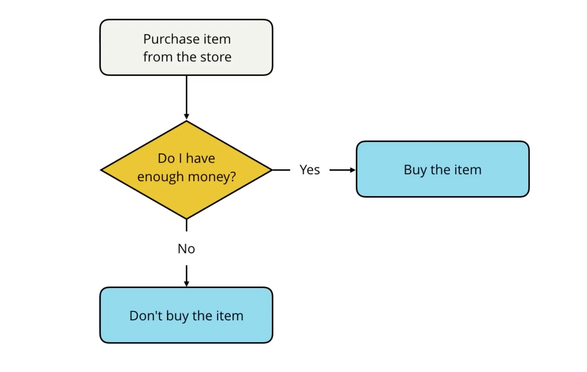

Implementing a desire involves actions and decisions, which can represented as
a flow chart.  Flow charts can be converted into code.

## IF-Else


```js
// Desire: want hammer ($15)
// In Pocket: $20
var hammer = 15
var inPocket = 20

// Do I have enough money?
if (inPocket >= hammer) {
  console.log("Buy the hammer!");
} else {
  console.log("Insufficient funds :-(");
}
```

Looks like JS if/else is like R's if/else.

## IF-ElseIf
```js
var weather = 'sunny';

if (weather === 'snow') {
  console.log('Bring a coat!');
} else if (weather === 'rain') {
  console.log('Better bring a rain coat!');
} else {
  console.log('What you've got on is good enough -- let's go!');
}
```

## Quiz: Even or Odd?
Write an if-else statement that determines whether a number is even or odd.

```js
var number = 3;

if (number % 2 === 0) {
  console.log('even');
} else {
  console.log('odd');
}
```

### Side Note: Make this into a function
I was playing around with the JavaScript console in Chrome and found out that defining
a function is basically the same syntax as R:

```js
evenOrOdd = function(num) {
  if (number % 2 === 0) {
    console.log('even');
  } else {
    console.log('odd');
  }
}
evenOrOdd(3);
  odd
```

In R, the semicolons are optional (actually, I've never used semicolons like that in R, but
I just tested it and it works with or without them just the same):
```r
evenOrOdd = function(num) {
  if (num %% 2 == 0) {
    print('even')
  } else {
    print('odd')
  }
}
evenOrOdd(3)
  odd
```

Actually... I was testing JavaScript a bit more and found out you don't even need the semicolons
inside the curly brackets for this language either... Yet the instructors of the course always seem to
use them, so it must be a best practice...b/c, for example, you need them for multiline statements w/in 
curly brackets (not necessarily true in the Chrome JS console, but maybe true in general).

## Quiz: Musical Groups

```js
// change the value of `musicians` to test your conditional statements
var musicians = 1;

// your code goes here
if (musicians <= 0) {
    console.log('not a group');
} else if (musicians === 1) {
    console.log('solo');
} else if (musicians === 2) {
    console.log('duet');
} else if (musicians === 3) {
    console.log('trio');
} else if (musicians === 4) {
    console.log('quartet');
} else {
    console.log('this is a large group');
}
```

## Quiz: Murder Mystery
```js
/*
 * Programming Quiz: Murder Mystery (3-4)
 */

// change the value of `room` and `suspect` to test your code
var room = "dining room";
var suspect = "Mr. Parkes";

var weapon = "";
var personInRoom = "";
var solved = false;

if (room === 'dining room') {
    personInRoom = 'Mr. Parkes';
    weapon = 'knife';
} else if (room === 'ballroom') {
    personInRoom = 'Mr. Kalehoff';
    weapon = 'poison';
} else if (room === 'gallery') {
    personInRoom = 'Ms. Van Cleve';
    weapon = 'trophy';
} else {
    personInRoom = 'Mrs. Sparr';
    weapon = 'pool stick';
}

if (suspect === personInRoom) {
    solved = true;
}

if (solved) {
	console.log(suspect + ' did it in the ' + room + ' with the ' + weapon + '!');
}
```

## Logical Operators
Again, similar to R.

JS:
```js
if ((1<2) && (2<3)) { console.log('Amen!'); }
```

R:
```r
if ((1<2) && (2<3)) { print('Amen!') }
```
JS:
```js
if ((3 > 4) || (4 > 3)) { console.log('Let there be order in the universe!'); }
```
R:
```r
if ((3 > 4) || (4 > 3)) { print('Let there be order in the universe!'); }
```

JS:
```js
if (!false) {print('Ain't that the truth!);}
```

R:
```r
if (!FALSE) {print('Ain't that the truth!')}
```

## Short Circuiting
For &&, both its arguments must be true to evaluate to true. Therefore, if we compute the first expression to be false, there is no need to compute the second expression: we can "short circuit" the computation.

For ||, only one of its arguments must be true to evaluate to true. Therefore, if we compute the first expression to be true, there is no need to compute the second expression:again, we can "short circuit" the computation.

## Quiz: Convert Bank Account Flow Chart into Code


```js
/*
 * Programming Quiz - Checking Your Balance (3-5)
 */

// change the values of `balance`, `checkBalance`, and `isActive` to test your code
var balance = 325.00;
var checkBalance = true;
var isActive = false;

// your code goes here
if (!checkBalance) {
    console.log('Thank you. Have a nice day!');
} else if (isActive && balance > 0) {
    console.log('Your balance is $' + balance.toFixed(2) + '.');
} else if (!isActive) {
    console.log('Your account is no longer active.');
} else if (balance === 0) {
    console.log('Your account is empty.');
} else {
    console.log('Your balance is negative. Please contact bank.');
}
```

## Quiz: Complexity of Ice Cream Code
```js
/*
 * Programming Quiz: Ice Cream (3-6)
 *
 * Write a single if statement that logs out the message:
 * 
 * "I'd like two scoops of __________ ice cream in a __________ with __________."
 * 
 * ...only if:
 *   - flavor is "vanilla" or "chocolate"
 *   - vessel is "cone" or "bowl"
 *   - toppings is "sprinkles" or "peanuts"
 *
 * We're only testing the if statement and your boolean operators. 
 * It's okay if the output string doesn't match exactly.
 */

// change the values of `flavor`, `vessel`, and `toppings` to test your code
var flavor = "vanilla";
var vessel = "cone";
var toppings = "sprinkles";

// Add your code here
if ((flavor==='vanilla' || flavor==='chocolate') 
    && (vessel==='cone' || vessel=='bowl') 
    && (toppings==='sprinkles' || toppings==='peanuts')
) {
    console.log("I'd like two scoops of " + flavor + " ice cream in a " + vessel + " with " + toppings + ".")
}
```

## Truthy and Falsy Values
This bit is more like what is found in Python: each value in JS has an inherent boolean value, which it is converted 
to if being evaluated in the context of a logical expression.

To be clear, from Python we often see:
```python
if var: # do something
```

Bascially, if that var exists, do something.  For example, all strings except the empty string
evaluate to true:
```python
if 'A string with text': print('Not empty!') 
  Not empty!
if '': print('Cats and dogs!')  # will not print
if None: print('Meh.')  # will not print
```

This is how things work in JavaScript too:
```js
if ('A string with text') { console.log('Not empty!'); } 
  Not empty!
if ('') { console.log('Cats and dogs!'); } // will not print
if (null) { console.log('Meh.') }  // will not print
```

Falsy JS things include: false, null, undefined, 0, '', and NaN.

The concept of truthiness is similar between JS and Python, but the particulars do not
always line up, e.g., in Python {} is an empty dictionary and is falsy, while in JS
empty curly brackets evaluate as truthy.

Python:
```python
if {}: print('Hell yea!')
  Hell yea!
```

JS:
```js
if ({}) { console.log('Hell yea!'); }  // will not print
```

As for R, it doesn't have this awesome feature.

## Ternary Operators
These seem similar in various languages... And oftentimes I forget them anyway.  But here it is
in JavaScript.

Example:
```js
var isGoing = true;
var color = isGoing ? "green" : "red";
console.log(color);
  green
```

This is a shorthand for an if-else statement.  It's pretty dang similar to IDL from what I 
remember.  Python has a similar construct.

JS:
```js
var color = isGoing ? "green" : "red";
```

Python:
```python
color = 'green' if isGoing else 'red'
```

And R has a shorthand function:
```r
ifelse(isGoing, 'green', 'red')
```

## The Switch/Case Statement
I don't know why, but I have found the switch/case syntax and terminology gets jumbled between languages.

In JS:
```js
switch(option) {
  case 1:
    console.log('Case 1');
    break; // necessary, otherwise all subsequent cases activate
  case 2:
    console.log('Case 2');
    break;
  case 3:
    console.log('Case 3');
    // no break statement necessary on final case
}
```

In IDL:
```idl
CASE <expression> OF
  expression: BEGIN
    ; statement
    END
  expression: BEGIN
    ; statement
    END
ENDCASE

; There is also a SWITCH statement in IDL...
; http://northstar-www.dartmouth.edu/doc/idl/html_6.2/SWITCH.html
```

R has a switch function:
```r
switch(expression, case1, case2, case3)
```

In Python, you just have to use if-elif-elif-else chains, or get clever with a dictionary.  
