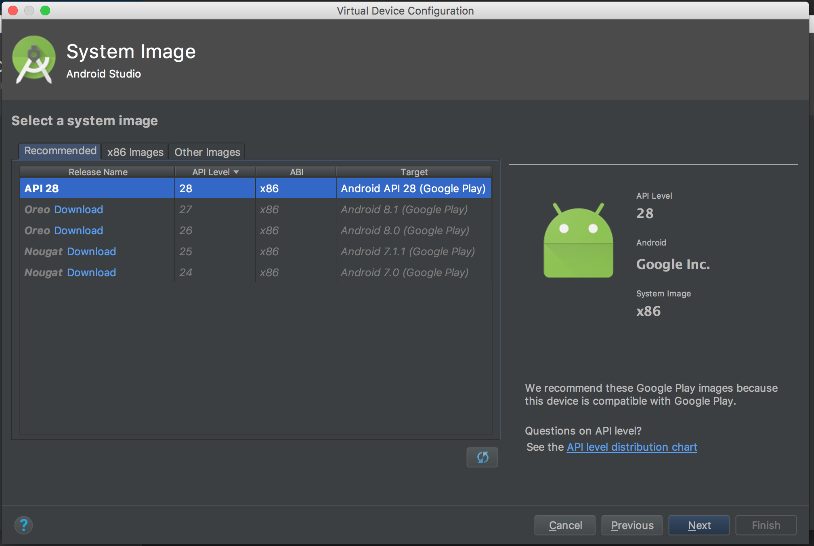

2018-07-03

# Emulators & Simulators
A “simulator” is software that mimics the appearance of a device, while an “emulator” is one that attempts to replicate 
the device fully (internals and all) as a virtual device.  Another way I’ve read this is:
* A simulator mimics the software environment of a device
* An emulator mimics both the software and hardware environments of a device

For example, the Apple Simulator is truly a simulator (link: [difference between iPhone Simulator and Android Emulator](https://stackoverflow.com/questions/4544588/difference-between-iphone-simulator-and-android-emulator)):
 
> “Apple always harps on the importance of device testing because iPhone Simulator does not emulate an iPhone processor, disk 
> drive, memory constraints and whatnot. You hardly ever get memory warnings unless your Mac is struggling to manage resources 
> itself, unless you simulate (again) memory warnings from the Simulator's menu item.”

## iPhone Simulator on MacOS
I found a lot of tutorials saying that the simulator would be located at XCode > Contents > Applications (e.g., here and 
here), however for XCode v9.4.1 on MacOS 10.13.5, it is located @
 
> Xcode > Contents > Developer > Applications
 
Also, it is simply called “Simulator,” not “iOS Simulator.”
 
It is pretty awesome!  You can simulate any iPhone every (as far as I can tell).  Here, I have a simulated iPhone 8 
and iPhone X running.


In the pic above, you can also see the various iPads that can be simulated.  But wait – there’s more!
 
At my work, we are also interested in developing for Apple Watch, which is also simulate-able:


Note that you cannot find Simulator easily in Spotlight Search:


So remember how to get to it in Finder, or set up some command line tools to open it up, e.g.:

```
alias isim="open /Applications/Xcode.app/Contents/Developer/Applications/Simulator.app"
```


## Android Emulator on MacOS
NOTE: I actually ran into a lot of twists and turns on this one... I'm going to log the notes here, but at one point
I should summarize them...

In tech speak, a “simulator” is software that merely mimics a device, while an “emulator” is a damn-nigh replication of 
the device – but virtually.  From reading about it (https://developer.android.com/studio/run/emulator), it seems like the 
“Android Emulator” lives up to its name.

First, I downloaded Android Studio:
> https://developer.android.com/studio/

When I DL’d Android Studio, the website offered some nice tutorials to try out:
* Build your first app:  https://developer.android.com/training/basics/firstapp/
* Android Fundamentals: https://www.udacity.com/course/new-android-fundamentals--ud851
* Meet Android Studio:  https://developer.android.com/studio/intro/
 
Btw, it’s a pretty big file (Android Studio 3.1.3 was 1.37GB).  It says 849MB on the download button, but when I 
dragged-and-dropped AS into the Applications folder, it was quite a bit bigger!  (Not that storage is a huge issue in 
this day and age, but if it is, then take heed.)
 
To open Android Studio, just open Spotlight (cmd+space) and begin typing “Android Studio.”
 
Side Note: Android Studio appears to be built by the same guys that built PyCharm (namely, JetBrains).
 
Upon your first open, you will have to set up Android Studio (e.g., location, UI theme).  You will then be asked to verify 
the settings:


Note that this setup downloads probably around another Gig.
 
Now, you will want to make sure you have the right SDK Tools. The [helpful blog](https://www.smashingmagazine.com/2014/09/testing-mobile-emulators-simulators-remote-debugging/) that I’ve been following says to 
follow [Google’s instructions](https://developer.android.com/studio/intro/update).  My mileage varied here... Probably b/c I wanted to get to SDK manager before having a 
project started... Anyway, still possible: on the opening Android Studio screen (AS 3.1.3), there is a “Configure” tab on 
the bottom right.  Click on it, then on SDK Manager.


This will bring you to a Preferences screen, where you start out in “Android SDK” on the left-hand nav bar and 
“SDK Platforms” on this screen’s own nav bar.  You want to go to “SDK Tools” on the screen’s nav bar.


All of Google’s recommended packages seem to come stock with a new project (unless you uncheck them).  These default, recommended packages are:
* Android SDK Build-Tools
* Android Emulator
* Android SDK Platform-Tools
* Android SDK Tools
* Intel x86 Emulator Accelerator (HAXM installer)
 
And then, from the Support Repository:
* Android Support Repository
* Google Repository
 
I then created a test app called “MyTestApp” ... but apparently the build failed?  Not even sure what that means 
(aside from “bad, possibly” – since it might just be b/c I have no code yet).

After about 45 minutes of trying to figure out how to set up an Android Virtual Device, I finally found the reason why 
I don’t seem to have that capacity on my computer:  [another tutorial]( informed me that one is supposed to install the 
Java Development Kit before one installs Android Studio.

Do you have JDK?  Just go to the command line and type:
```
java -version
```

If you do not have it (which I didn’t on my new work laptop), then a dialog box will pop up asking if you want to install it:


I was tempted to brew cask install Java, but the guy in the video said that Android will complain if you do not use 
Java 6... And apparently this issue is pervasive enough that Mac maintains a support page for it:
 
**Java for OS X**: https://support.apple.com/kb/DL1572?locale=en_US

That is some old Java... What if I needed some new Java?  Well, in that case, I’ve seen a lot of people talking “jenv”, 
which is a Java environment manager.  Apparently, you brew install it, then brew install a bunch of different versions 
of Java and use jenv to switch between them.

**Switching Java environments**: http://www.jenv.be/
 
Now, disappointingly, I’m not sure the Java installation was my problem or not... b/c I still couldn’t find an AVD manager 
anywhere in Android Studio.  I kept getting an error about not finding the SDK Build Tools… Wait, what?!  I clicked on it 
and it asked me if I wanted to download them.  Well, yea!  Once I did, the AVD manager showed up.

But anyway, the guy in the video also says that I needed Java 6 for the Java 6 JRE... but that I would actually need a
much newer version of Java installed for everything else.  If you’re not following, you’re in good company: me.  If you’re 
me reading this, well then... Hello darkness, my old friend…

Anyway, at this point I went off course and just brew cask installed:

```
brew install jenv  # might need it
brew cask install java
which java
```

I kind of know some things are going right b/c in the video he says that after you first install “Java 6 for OS X”, you 
will not yet have a Java icon in System Preferences (which I didn’t).  He then downloads the latest version of Java from 
Oracle’s website (Java 8 at the time of the recording) and install, at which point he does have a Java icon in System 
Preferences.  Though I brew cask installed the latest version (Java 10), this was my experience as well.


Well, for sanity’s sake, this other video tutorial covers the same thing: 
1. download the Java 6 JRE as we did, then
2. download the latest JDK

### One last things for developing for wearables (Android Watch)

I noticed when trying to start a Wear project that I couldn’t set a default Activity screen: I needed a minimum SDK level of 22.


I then noticed in the SDK manager I only have the latest version of Android SDK.  The fix was easy: I just downloaded
a bunch of the older SDKs.  


Actually, I went all the way down to Android 4.4 (KitKat) since I’m developing on an Android 5.0 (Lollipop) and figure a bunch of people might have an even older OS.  This solved the wearables issue I pointed out above (good!).

### Ok, ok -- emulate something already!!


Choose a device (seems that the current default is Nexus 5X):


Download at least one system image (I just dl’d API 28):



On the next screen, give it a name and finish up.  Open the device by double clicking on the device name 
in the AVD (or using command line tools):

\


### Trouble w/ the internet
Gah… Internet still not working w/ any of this. 
```
export ANDROID_HOME=/Users/UserName/Library/Android/sdk
export ANDROID_SDK_ROOT=/Users/UserName/Library/Android/sdk
export ANDROID_AVD_HOME=/Users/UserName/.android/avd
 ```
 
* 2011:  http://www.gitshah.com/2011/02/android-fixing-no-internet-connection.html
* 2011:  https://laaptu.wordpress.com/2011/06/14/solution-to-android-emulator-not-connecting-to-internet-even-though-there-is-internet-connection-on-computer/
* 2015:  https://stackoverflow.com/questions/33629399/not-able-to-activate-internet-on-android-emulator
* 2018:  https://stackoverflow.com/questions/48411091/mac-os-high-sierra-10-13-2-android-emulator-has-no-internet-connection
* 2018:  https://stackoverflow.com/questions/49535453/android-studios-emulator-is-not-connecting-to-internet
* 2018:  https://coderwall.com/p/hvj0da/fix-internet-connection-in-android-emulator
 
 
My AVD still doesn’t get internet.....
 
Trying something new… Making a new AVD: Pixel 2 w/ Lollipop (Android 5.1, API level 22).
 
Same problem…
 
I saw that some guy here said that wiping the data from his AVD did the trick… So I did that, and opened the emulator again while in Android Studio… That’s when I noticed a few error messages. 


Oi vey, ay carramba...  More on this later.

LATER

Got another error message (wish I screenshotted it) basically telling me that another adb server was already running, to exit out of AS, shut down that server, then reopen AS.
 
Anyway, I did that… And things still didn’t work.  Then I remember reading someone saying to restart the AVD.  Now, for the past several hours (frown!) I’ve interpreted that to mean to exit out of the AVD…  At one point, I did hit the AVD’s power button – but only put it to sleep.  The memory of that simple line came back to me at this point, and so I clicked-and-held the AVD’s power button: it gave me the option to power off or to restart.  I restarted. 
 
And that is all!  Internet works.  Sort of.  Using the browser still doesn’t work… But using the Google Search bar at the bottom of the screen does! 
 
Don’t ask me to explain… I’m just happy things are working… Sort of.  Can I explain it?  Not yet.  Hell, this option might have worked all day for all I know.
 
More insight:  all my google searches work EXCEPT when I request a specific URL.  So what is happening is … I have access to Google and that’s it.  Wish I was more eloquent here…but…yea.
 
AT LEAST I HAVE SOMETHING NEW TO GOOGLE!

### Command line tools

When using Android Studio, it almost seems like you have to have a project open to use an Android Virtual Device (AVD).  This isn’t true, though creating the AVDs through the GUI like this makes things a little easy when starting out.  However, once created, you can just open that AVD whenever you want using the “emulator” command, which can be found in ~/Library/Android/sdk/tools.  If you want, you can add some things to your .bash_profile so this is in the system PATH by default.  I made a function that does this when called just in case there are any namespace issues w/ other things I might use (there might not be, but I certainly haven’t vetted the available functions just yet).

```
#=============================================
# ANDROID
#============================================
# -- this function adds all the Android commands to the PATH
# -- I don't have it happen by default just in case there is any kind of
#    namespace issue; if this isn't the case going forward, it can become
#    default behavior
add_android() {
  export ANDROID_SDK=$HOME/Library/Android/sdk;
  export PATH=$ANDROID_SDK/emulator:$ANDROID_SDK/tools:$PATH;
  alias adb=/Users/kevinurban/Library/Android/sdk/platform-tools/adb
}
```

From the command line:
```
Now from the command line:
# List all available AVDs
emulator -list-avds
 
# Open up a specific emulator
emulator @emulator_name
 
# e.g., the emulator I created before
emulator @Nexus_5X_API_28
```


# Remote Debugging

## Remote iPhone Debugging on MacOS
For this, you need to use Safari on both the iOS device and your MacOS device. 
 
On your iOS device (iOS 6.0+), go into Settings > Safari > Advanced and click to enable Web Inspector.  Then on your 
MacOS device, open Safari and go to Safari > Preferences > Advanced and click “Show Develop menu in menu bar”.


Then in the menu bar, go to Develop and select your iPhone.  You might have to pair the devices.  Also, once paired, 
seems you have to physically look at a tab for it to show up on your iPhone’s list of open websites (you can go to 
another tab afterwards).
 
Here is an instance of Safari’s Web Inspector looking at a Google page:


