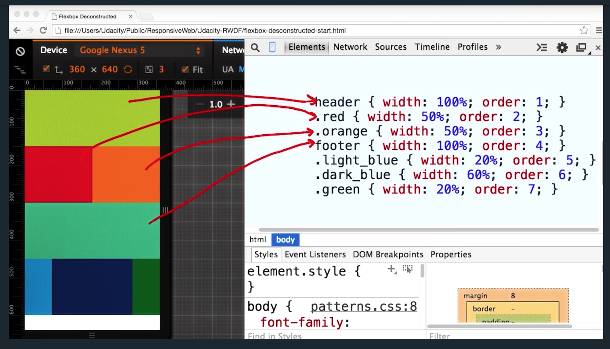

Page layout.  Design patterns.  More responsive hoo-ha.

------------------

## Basic Media Query Intro

"A responsive site changes based on the characteristics of a device."  This means
that your webpage needs to apply different styles/CSS for different devices...  The easiest
way to do this is with "media queries."

Media queries provide simple logical approach to changing CSS layouts based on device
characteristics, such as device height, device width, or device pixel ratio.

To do this is simple: you just add a link tag that looks something like this:
```html
<link rel="stylesheet" media="screen and (min-width: 300px)" href="patterns.css">
```

> Media queries are useful when you want to apply CSS styles depending on a device's general type (such as print vs. screen), specific characteristics (such as the width of the browser viewport, or environment (such as ambient light conditions). With the huge variety of internet-connected devices available today, media queries are a vital tool for building websites and apps that are robust enough to work on whatever hardware your users have.

Source: https://developer.mozilla.org/en-US/docs/Web/CSS/Media_Queries/Using_media_queries

## Adding a Basic Media Query
We'll define a stylesheet to be used only when the viewport is wider than 500 pixels.

```html
<link rel="stylesheet" href="styles.css">
<link rel="stylesheet" media="screen and (min-width: 500px)" href="over500.css">
```

The `over500.css` file should have changes in the CSS, which take affect when the screen
is made larger than 500 pixels...


### My Example
This is cool as hell, and very simple.  Check out my GIF below; all it took was
a simple HTML file and two .css files.

index.html:
```html
<html>
  <head>
    <link rel="stylesheet" href="styles.css">
    <link rel="stylesheet" media="screen and (min-width: 500px)" href="over500.css">
  </head>
  <body>
    Hello, world!
  </body>
</html>
```

styles.css:
```css
body {
  background-color: red;
}
```

over500.css:
```css
body {
  background-color: blue;
}
```


## Another way to add a Media Query: @media
The linked media query can result in many small HTTP requests.

The @media query can result in some big HTTP requests.

Media queries are almost always based on min-width or max-width.  Don't be stupid: don't
use min-device-width or max-device-width, as these refer to physical device lengths and not browser pixels.

## Media Query Quiz
* http://udacity.github.io/RWDF-samples/quizzes/media-queries-quiz.html

Basically, we had to add some breakpoints in a style tag in the head:
```html
<!doctype html>
<html lang="en">
  <head>
  <title>min-width and max-width Median Queries</title>
  <meta charset="utf-8">
  <meta name="viewport" content="width=device-width, initial-scale=1.0">
  <link rel="stylesheet" type="text/css" href="../default-styles.css">
  
  <style type="text/css">
    h1 { ... }
    @media screen and (max-width: 400px) {
      body {background-color: red;}
    }
    @media screen and (min-width: 400px) {
      body {background-color: green;}
    }
    @media screen and (min-width: 600px) {
      body {background-color: blue;}
    }
  </style>
  
  </head>
  <body>
  ...
  </body>
</html>
```

## Break Points
Break points are the screen size triggers (media queries) that cause changes in layout.  In the videos,
we are shown examples where complex layout changes are implemented, e.g., for a very small screen, there
is no nav bar (it is all in the "hamburger" icon), while larger screens have nav bars.

A question is: where should a designer decide to put break points?  Seems to me that there are some
common screen sizes that designers choose.  That said, the instructors say, "let the content guide
you."  Here's a wishy washy quote: "We shouldn't choose our break points at all: we should find them
using our content as a guide."

Pete LePege's tips:
* starts developing webpage for device with smallest viewport in Chrome emulator
* next, slowly resizes window, looking out for a point at which the content starts looking like it needs a break point
(e.g., starts to look like there is too much space between table columns, etc)


## Complex Media Queries
Basically instead of one condition (min-width: 500px), you use more than one condition
((min-width: 500px) and (max-width: 600px)).

Example:
```css
@media screen and (min-width: 500px) and (max-width: 600) {
  .yes {
    opacity: 1;
  }
  .no {
    opacity: 0;
  }
}
```

From MDN's [Media Query Guide](https://developer.mozilla.org/en-US/docs/Web/CSS/Media_Queries/Using_media_queries)
> Sometimes you may want to create a media query that depends on multiple conditions. This is where the logical operators come in: not, and, and only. Furthermore, you can combine multiple media queries into a comma-separated list; this allows you to apply the same styles in different situations.

### Operators
and: both/all conditions must be met
```css
@media screen and (min-width: 30em) and (orientation: landscape) {...}
```

commas: any condition is met (I guess it's the OR operator)
```css
@media (min-height: 680px), screen and (orientation: portrait) {...}
```

There is also a `not` operator.  It is evaluated last in an expression:
```css
@media not all and (monochrome) {...}
```

Given that `not` is evaluated last, the above is evaluated like:
```
@media not (all and (monochrome)) {...}
```

### Overlapping Media Queries
Note that media query "domains" can overlap.
```css
@media screen and (max-width: 400px) {...}
@media screen and (min-width: 301px) and (max-width: 600px) {...}
@media screen and (min-width: 601 px) {...}
@media screen and (min-width: 961 px) {...}
```

## Grids
The "grid fluid system"... Bootstrap is an example of this type of system.

* [Basic example of grid layout](https://developer.mozilla.org/en-US/docs/Web/CSS/CSS_Grid_Layout)
* [Basic concepts of grid layout](https://developer.mozilla.org/en-US/docs/Web/CSS/CSS_Grid_Layout/Basic_Concepts_of_Grid_Layout)
* [Relationship of grid layout to other layout methods](https://developer.mozilla.org/en-US/docs/Web/CSS/CSS_Grid_Layout/Relationship_of_Grid_Layout)

### Simple example of Grid
HTML:
```html
<div class="wrapper">
  <div class="one">One</div>
  <div class="two">Two</div>
  <div class="three">Three</div>
  <div class="four">Four</div>
  <div class="five">Five</div>
  <div class="six">Six</div>
</div>
```
CSS:
```css
.wrapper {
  display: grid;
  grid-template-columns: repeat(3, 1fr);
  grid-gap: 10px;
  grid-auto-rows: minmax(100px, auto);
}
.one {
  grid-column: 1 / 3;
  grid-row: 1;
}
.two { 
  grid-column: 2 / 4;
  grid-row: 1 / 3;
}
.three {
  grid-column: 1;
  grid-row: 2 / 5;
}
.four {
  grid-column: 3;
  grid-row: 3;
}
.five {
  grid-column: 2;
  grid-row: 4;
}
.six {
  grid-column: 3;
  grid-row: 4;
}
```
To see what this looks like: https://developer.mozilla.org/en-US/docs/Web/CSS/CSS_Grid_Layout

## Flexbox
This guide is amazing:
* CSS Tricks: [A Complete Guide to Flexbox](https://css-tricks.com/snippets/css/a-guide-to-flexbox/)

Example:
```html
<div class="container">
  <div class="box dark_blue"></div>
  <div class="box light_blue"></div>
  <div class="box green"></div>
</div>
```
The boxes will be aligned in a row and will wrap to a new row if
there is not enough screen... 
```css
.container {
  width: 100%;
  dispaly: flex;
  flex-wrap: wrap;
}
.box {
  width: 150px;
}
```

Also, we can change the ordering of the boxes w/ a media query:
```css
@media screen and (min-width: 700px) {
  .dark_blue {order: 3;}
  .light_blue {order: 2;}
  .green {order: 1;}
}
```

-------------

Another flexbox example:


## Grid
CSS Tricks: [A Complete Guide to Grid](https://css-tricks.com/snippets/css/complete-guide-grid/)

> Flexbox ... is intended for simpler one-dimensional layouts, not complex two-dimensional ones (Flexbox and Grid actually
work very well together). 

