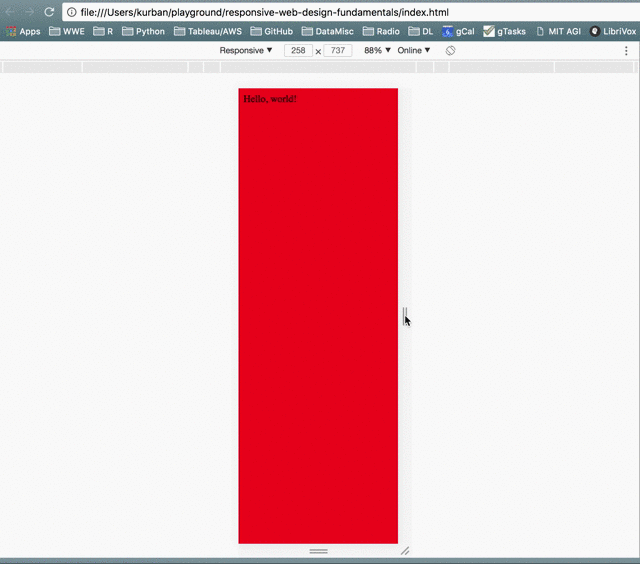

Page layout.  Design patterns.  More responsive hoo-ha.

------------------

## Basic Media Query Intro

"A responsive site changes based on the characteristics of a device."  This means
that your webpage needs to apply different styles/CSS for different devices...  The easiest
way to do this is with "media queries."

Media queries provide simple logical approach to changing CSS layouts based on device
characteristics, such as device height, device width, or device pixel ratio.

To do this is simple: you just add a link tag that looks something like this:
```html
<link rel="stylesheet" media="screen and (min-width: 300px)" href="patterns.css">
```

## Adding a Basic Media Query
We'll define a stylesheet to be used only when the viewport is wider than 500 pixels.

```html
<link rel="stylesheet" href="styles.css">
<link rel="stylesheet" media="screen and (min-width: 500px)" href="over500.css">
```

The `over500.css` file should have changes in the CSS, which take affect when the screen
is made larger than 500 pixels...


