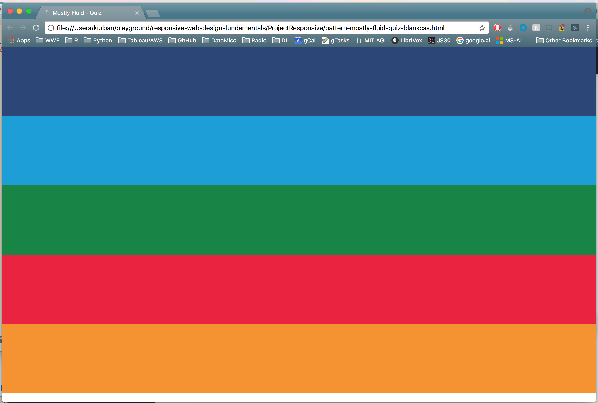
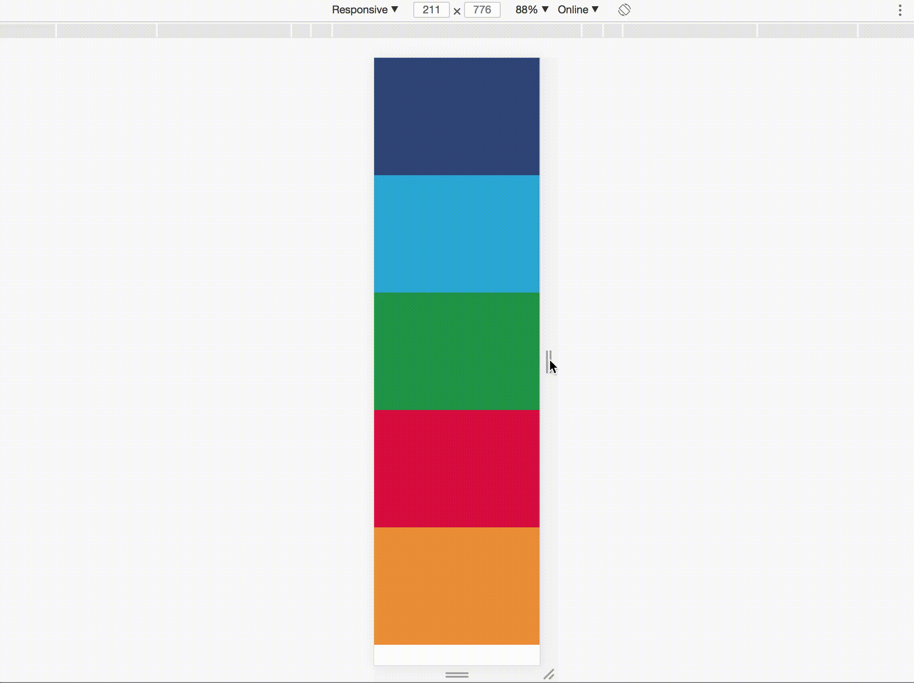

There are 4 fairly standard design patterns:
* mostly fluid
* layout shifter
* column drop
* off canvas

To see a bunch of design patterns in action:
* https://responsivedesign.is/patterns/
* https://bradfrost.github.io/this-is-responsive/patterns.html

Pete LePage's webpage on responsive design:
* https://developers.google.com/web/fundamentals/design-and-ux/responsive/patterns

This page has nice static visuals of the various design patterns.  Below, I try to
emulate some of them with stacking/reshifting boxes, but definitely check out the
aforementioned webpages for a better idea.


## Column Drop
On a small screen, we start with a vertical stack:

<table>
  <tr><td> &#9635; </td></tr>
  <tr><td> &#9636; </td></tr>
  <tr><td> &#9641; </td></tr>
</table>

Then as you widen the screen, the div elements reflow:

<table>
  <tr><td> &#9635; &#9636; </td></tr>
  <tr><td> &#9641; &#9641;</td></tr>
</table>

And finally a row:
<table>
  <tr><td> &#9635; &#9636; &#9641; </td></tr>
</table>

If you continue expanding the screen, the elements either grow with the screen, or
more commonly they reach a certain size at which point margins begin to grow at the sides.

HTML:
```html
<div class="container">
  <div class="box one"></div>
  <div class="box two"></div>
  <div class="box three"></div>
</div>
```

CSS:
```css
.container {
  display: flex;
  flex-wrap: wrap;
}

.box {
  width: 100%;
}

@media screen and (min-width: 450px) {
  .one, .two { width: 50%; }
}

@media screen and (min-width: 600px) {
  .one, .two, .three { width: 33.33%; }
}
```

## Mostly Fluid
This pattern is similar to column drop, except that the designer usually picks
fairly specific reflows for each break point, whereas column drop more continuously
reflows into a row.  Actually, the two are highly similar... Seems like the major
difference is that "mostly fluid" ultimately settles into a grid-like design, whereas
"column drop" settles into a row... 

<table>
  <tr><td> &#9635; </td></tr>
  <tr><td> &#9636; </td></tr>
  <tr><td> &#9672; </td></tr>
  <tr><td> &#9641; </td></tr>
</table>

Hit a breakpoint, then:

<table>
  <tr><td> &#9635; &#9636; &#9636; &#9636; </td></tr>
  <tr><td> &#9672; &#9672; &#9641; &#9641; </td></tr>
</table>

Then, hit another breakpoint and, e.g., margins form and continue
to grow w/ increased screen widths.

The code looks something like...

HTML:
```html
<div class="container">
  <div class="box1"></div>
  <div class="box2"></div>
  <div class="box3"></div>
  <div class="box4"></div>
</div>
```

CSS:
```css
.container {
  display: -webkit-flex;
  display: flex;
  -webkit-flex-flow: row wrap;
  flex-flow: row wrap;
}

.box1, .box2, .box3, .box4, .box5 {
  width: 100%;
}

@media (min-width: 600px) {
  .box1 { width: 25%; }
  .box2 { width: 75%; }
  .box3, .box4 {width: 50%; }
}

@media (min-width: 800px) {
  .container {
    width: 800px;
    margin-left: auto;
    margin-right: auto;
  }
}
```

## Layout Shifter
Similar to the mostly fluid pattern, but breakpoints cause changes in the
cell left-to-right, top-to-bottom topology/connectivity:
that changes the neighbors.

<table>
  <tr><td> &#9635; </td></tr>
  <tr><td> &#9636; </td></tr>
  <tr><td> &#9672; </td></tr>
  <tr><td> &#9641; </td></tr>
</table>

Hit a breakpoint, then:
<table>
  <tr><td> &#9635; &#9636; &#9636; </td></tr>
  <tr><td> &#9635; &#9672; &#9641; </td></tr>
</table>

The top bar became the side bar.

## Off Canvas
With this pattern, the designer takes advantage of "off screen" design.  That is,
the designer is ok with some cells not getting representation on the active
screen...  A bit harder to draw w/ just squares... :-p

-----------------------------------------------------

# Project
First of all, before even editing the project, take a look at how cool the page is:



The code to produce this is all in one HTML file:

```html
<!DOCTYPE html>
<html lang="en">
  <head>
    <title>Mostly Fluid - Quiz</title>
    <meta charset="utf-8">
    <meta name="viewport" content="width=device-width, initial-scale=1.0">
    <style type="text/css">
      /*
      These are the default styles. No need to change these.
      */
      
      @import url(https://fonts.googleapis.com/css?family=Roboto);
      
      html, body {
        margin: 0;
        padding: 0;
      }

      body { font-family: 'Roboto', sans-serif; }

      .title {
        font-size: 2.5em;
        text-align: center;
      }

      .box { min-height: 150px; }

      .dark_blue { background-color: #2A457A; }
      .light_blue { background-color: #099DD9; }
      .green { background-color: #0C8542; }
      .red { background-color: #EC1D3B; }
      .orange { background-color: #F79420; }
  
    </style>
  
    <style type="text/css">
      /*
      TODO: These are the responsive styles. Throw some breakpoints in here!
      */
      .container {
        display: flex;
        flex-wrap: wrap;
      }

      .box {
        width: 100%;
      }
  
    </style>
  
  </head>
  <body>
    <div class="container">
      <div class="box dark_blue"></div>
      <div class="box light_blue"></div>
      <div class="box green"></div>
      <div class="box red"></div>
      <div class="box orange"></div>
    </div>
  </body>
</html>
```

My job is to throw in some breakpoints at 450px, 550px, and 800px.

```css
<style type="text/css">
  /*
  TODO: These are the responsive styles. Throw some breakpoints in here!
  */
  .container {
    display: flex;
    flex-wrap: wrap;
  }

  .box {
    width: 100%;
  }
  
  @media screen and (min-width: 450px) {
    .light_blue, .green { width: 50%; }
  }

  @media screen and (min-width: 550px) {
    .red { width: 25%; }
    .orange { width: 75%; }
  }

  @media screen and (min-width: 800px) {
    .container {
      width: 800px;
      margin-left: auto;
      margin-right: auto;
    }
  }
  
</style>
```




------------------------------------

FFMPEG conversions:
* use QuickTime to screen record
* use FFMPEG to convert .mov to .gif while reducing frame rate, etc

```bash
ffmpeg -ss 00:00:00.000 -i responsive-project.mov -pix_fmt rgb24 -r 2  -t 8 output.gif
```

Supposedly this is supposed to help, but it didn't seem to do much in my experimentation and
only bloated the file sizes....

```bash
convert -layers Optimize output4.gif output-optimized.gif
```

Some help:
* https://superuser.com/questions/436056/how-can-i-get-ffmpeg-to-convert-a-mov-to-a-gif
